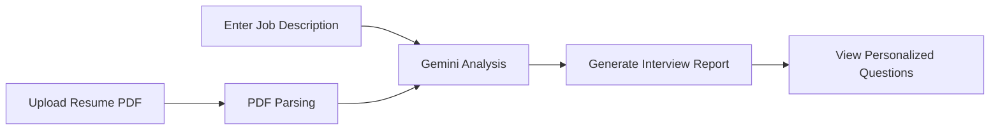

# InterPrep 🚀

> **AI-powered interview preparation platform that analyzes your resume against a job description and generates personalized interview preparation reports.**


---

## 📖 Overview

InterPrep helps candidates prepare for interviews by combining resume analysis with Generative AI.

Users upload their resume (PDF), provide a target job description, and receive an AI-generated interview preparation report containing:

* Resume-job match score
* Personalized technical interview questions
* Behavioral interview questions
* Suggested answers
* Interviewer's intent behind each question

Instead of practicing generic interview questions, candidates receive preparation tailored specifically to the role they're applying for.

---

## ✨ Features

* 🔐 JWT-based authentication
* 📄 Resume PDF upload
* 🤖 Google Gemini powered interview analysis
* 📊 Resume-to-job match scoring
* 💻 Technical interview question generation
* 💬 Behavioral interview question generation
* 📝 Suggested answers with interviewer intent
* 📚 Previous report history
* 🎯 Personalized interview preparation

---

## 🛠 Tech Stack

### Frontend

* React 19
* React Router
* Axios
* Sass
* Vite

### Backend

* Node.js
* Express
* MongoDB
* Mongoose
* JWT Authentication
* Multer
* PDF Parse
* Google Gemini API
* Zod

---

## 🏗 Project Structure

```text
InterPrep/
│
├── frontend/
│   ├── src/
│   │   ├── features/
│   │   │   ├── auth/
│   │   │   └── report/
│   │   ├── App.jsx
│   │   └── app.routes.jsx
│   └── package.json
│
├── backend/
│   ├── src/
│   │   ├── controllers/
│   │   ├── middleware/
│   │   ├── models/
│   │   ├── routes/
│   │   ├── services/
│   │   └── config/
│   ├── server.js
│   └── package.json
│
└── README.md
```

---

## ⚙️ How It Works



---

## 🚀 Getting Started

### Clone the repository

```bash
git clone https://github.com/Zypher90/interprep.git

cd interprep
```

---

### Backend

```bash
cd backend

npm install

npm run dev
```

Create a `.env` file:

```env
PORT=5000

MONGODB_URI=your_mongodb_connection_string

JWT_SECRET=your_secret

GOOGLE_API_KEY=your_gemini_api_key
```

---

### Frontend

```bash
cd frontend

npm install

npm run dev
```

---

## 💡 Usage

1. Register or log in.
2. Upload your resume in PDF format.
3. Paste the target job description.
4. Submit the analysis request.
5. Review your personalized interview report.
6. Practice the generated technical and behavioral questions.

---

## 📊 AI Report Includes

* Resume Match Score
* Technical Interview Questions
* Behavioral Interview Questions
* Interviewer's Intent
* Suggested Answers

---

## 🔒 Authentication

The application uses JWT authentication for securing protected routes and user-specific interview reports.

---

## 📁 API Overview

### Authentication

```
POST /auth/register

POST /auth/login
```

### Reports

```
POST /report

GET /report/:id
```

---

## 🔮 Future Improvements

* Voice mock interviews
* AI feedback on spoken answers
* ATS optimization suggestions
* Resume improvement recommendations
* Company-specific interview preparation
* Coding assessment integration
* Export reports as PDF
* Interview progress dashboard

---

## 🤝 Contributing

Contributions are welcome.

1. Fork the repository
2. Create a feature branch

```bash
git checkout -b feature/my-feature
```

3. Commit your changes

```bash
git commit -m "Add new feature"
```

4. Push to your branch

```bash
git push origin feature/my-feature
```

5. Open a Pull Request

---

## 📄 License

This project is licensed under the MIT License.

---

## 👨‍💻 Author

GitHub: https://github.com/Zypher90

---

If you found this project useful, consider giving it a ⭐ on GitHub!
